# Project 4 - The Restaurant 


The Restaurant is a ficticious restaurant page created using the Django Framework, Python, HTML and CSS/bootstrap. 
### View the site - [The Restaurant](https://therestaurant-ec18b29952b2.herokuapp.com/)
<br>

## Table of Contents

* [User Experience (UX)](#user-experience-ux)
  * [Initial Discussion](#initial-discussion)
  * [User Stories](#user-stories)
* [Design](#design)
  * [Wireframes](#wireframes)
  * [Database Schema](#database-schema)
  * [Features](#features)
* [Technologies Used](#technologies-used)
  * [Languages Used](#languages-used)
  * [Libraries & Programs Used](#libraries--programs-used)
* [Deployment & Local Development](#deployment--local-development)
  * [Deployment](#deployment)
* [Testing](#testing)
  * [Solved Bugs](#solved-bugs)
  * [Known Bugs](#known-bugs)
  * [Tesing User Stories](#testing-user-stories)
  * [Full Testing](#full-testing)
* [Credits](#credits)
* [Media](#media)
* [Acknowledgments](#acknowledgments)

## User Experience (UX)
### Initial Discussion
The restaurants website was created for online presence, but more importantly - to allow customers to book a table and view the menu. This needed to be quick and easy for the user - only requiring a quick signup and to fill out their booking details. 
 

### User Stories
A full list of user stories with documentation outlining the user stories and their respective storyboard can be found [here.](https://github.com/users/DavidUWL/projects/1/views/1?pane=info) 
<br>
If the README does not open, it can be located with the image below. 
<br>
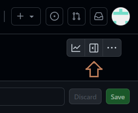 


## Design
With restaurant website designs, minimalist designs typically work best. Visually striking imagery with minimal text usually provides streamlined user experiences and give an elegance to the page. Using the Django Framework, all pages will be an extension of the homepage and as such have consistency. 

## Wireframes


### Homepage
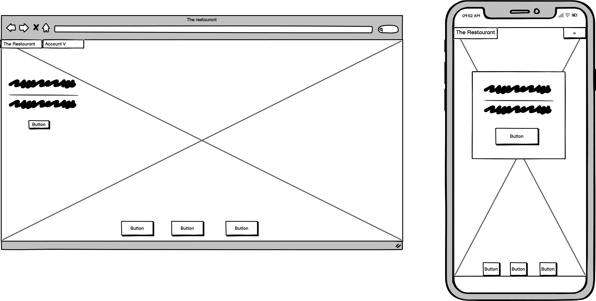 <br>
* With the homepage above, i wanted a large striking hero image with strong colours to set the tone for the website. With a short succinct lead line and tagline for the customer to remember. A call to action below this to book a table. 
A navbar above containing the brand that will link to the homepage. The navbar will expand on mobile into a dropdown. A footer at the bottom of the page that simply links to the restaurants socials. The homepage's structure also lends itself to other uses, like confirming a users booking, or logging in/logging out. 

### Book Table
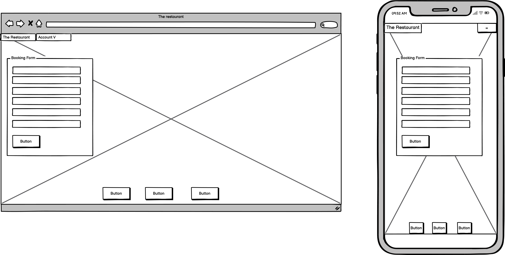
* With the book table page, there is simply one call to action here, the booking form. A streamlined booking page lends itself to the user not being distracted by any other on screen details and focus on the task at hand. 

### View Bookings
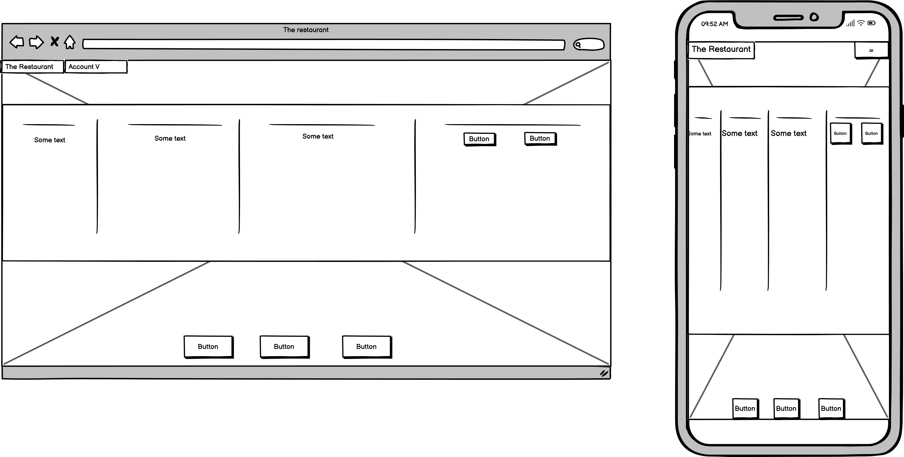
* The view bookings page will return a list of the users bookings and render them within a table. on the right of this, there will be two buttons that will allow the user to cancel or amend their booking. With mobile, this will be responsive and scrollable. 

### Menu 

* The menu page will render a table of menu entries and their descriptions in a table format.

## Database Schema 
A relational database was used for this project, as it would best suit the needs of the project. The schema below was created using [Figma.](https://www.figma.com) <br>
_For more information on the User table/objects please refer to the_ [AllAuth Documentation.](https://docs.allauth.org/en/latest/index.html)
<br>

* Columns and their respective keys are outlined with the --> and <-- arrows. 
* Columns have their names and attributed types outlined. 

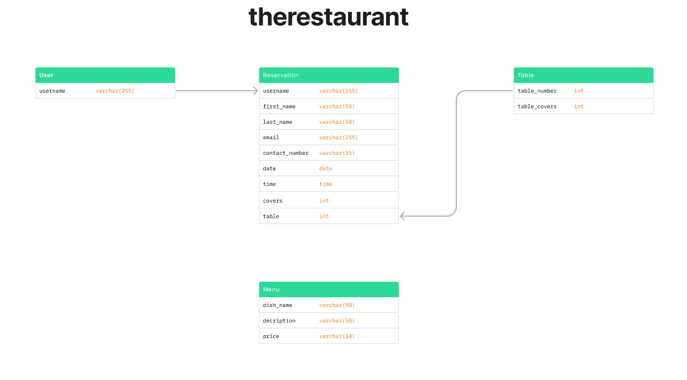

## Color Palette 
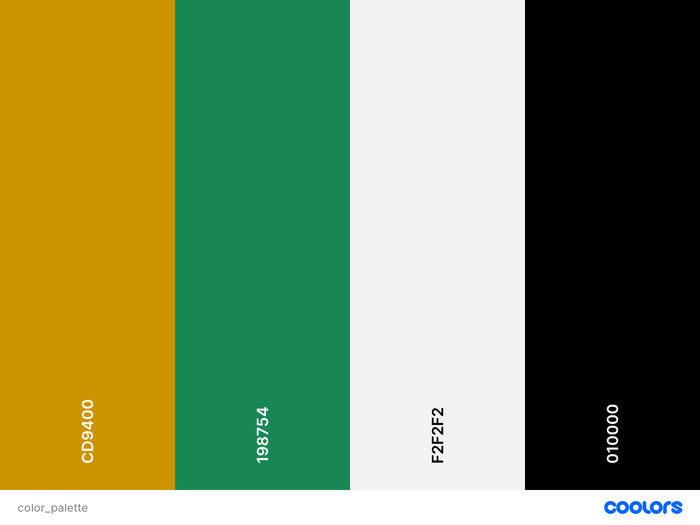
* The color palette for this project was derived from the colors in the hero image. I felt that consistency between the two would be quite visually pleasing, and the colours were strong. Some issues between text colors and the hero image arose due to containing both black and white. This was contrasted by adding a background colour and modifying opacity with certain elements. 

## Typography 
The
[Playfair Display](https://fonts.google.com/specimen/Playfair+Display?query=playfair+display)
Google Font was used for the text in this project, suiting the minimalist design with its straight edging and thicker style. Relying on a standard Serif font as a backup if the google font becomes unavailable. 

## Features By Page

### Home page
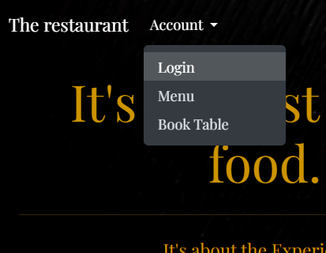<br>
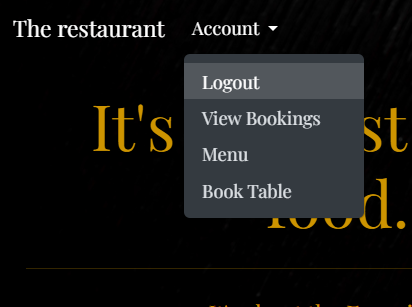
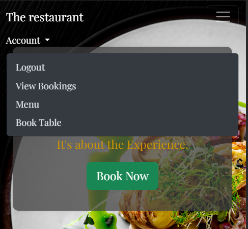

* The home pages Navbar is dynamic based on the login state of the user. Users will not be able to view their bookings until they are authenticated. 
<hr>

### booking a Table
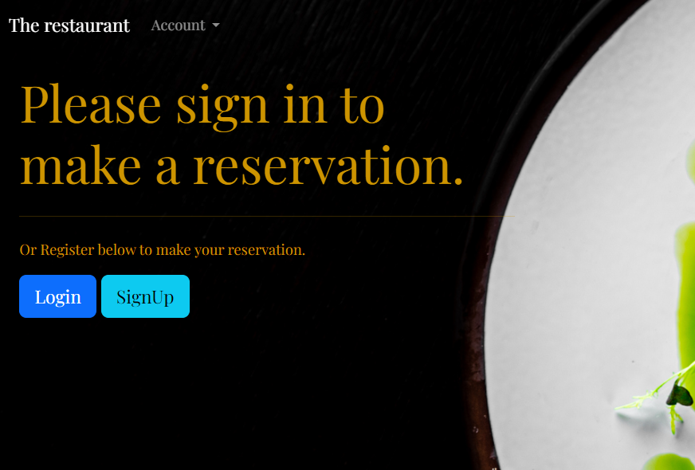
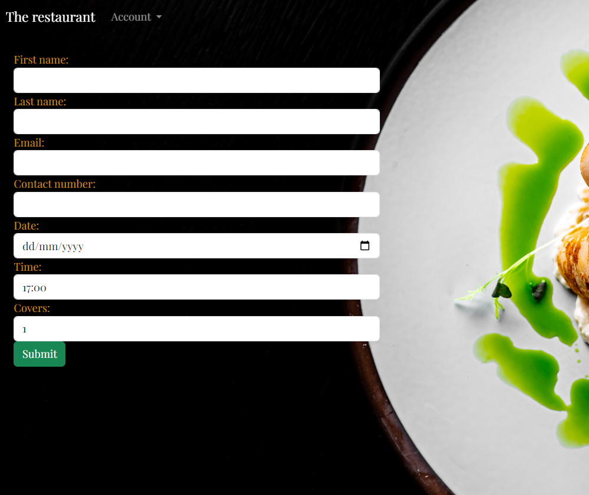
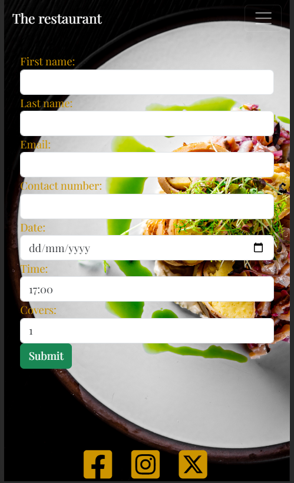
* The Reservation page is dynamic depending on the authentication state, if the user is not logged in, they will be prompted to either login or register. Once they are authenticated, they will be redirected to the homepage and will receive the "Book Table" call to action.
* Once authenticated, the user is prompted with their booking form.This consists of the standard fields which includes a calendar popout for the date field and dropdowns for the times and covers. 
<hr>

### Viewing the Menu
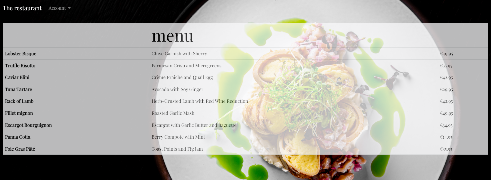
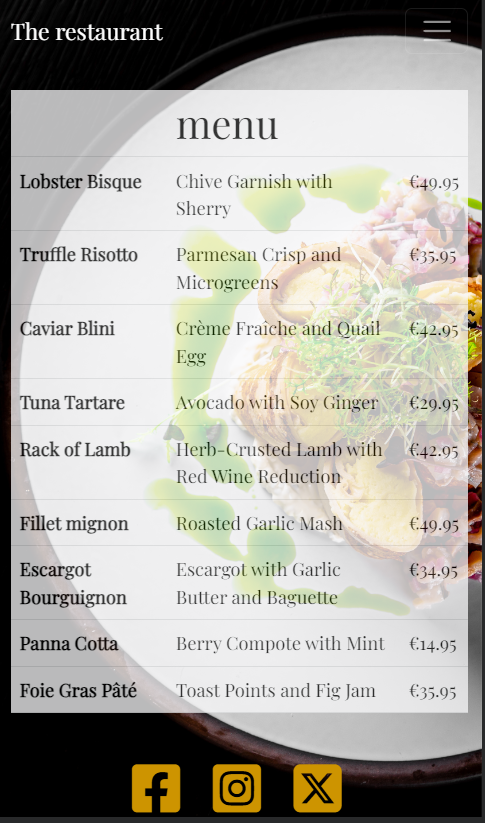
* The menu will render and will be responsive on mobile. Although this is data from a database, i wanted this to be as close to a menu's looks while being simple. 
<hr>

### Viewing User Bookings
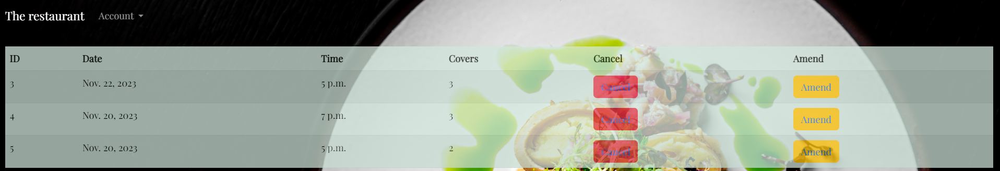
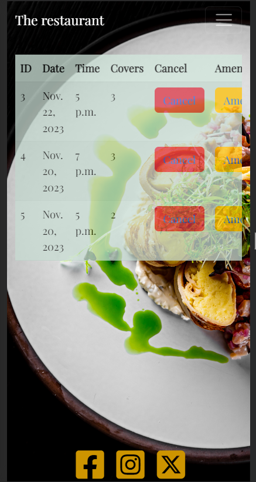
* The view bookings panel can only be accessed when authenticated, users can cancel their associated booking or amend the details contained in it. 
* Depending on viewports, the table will be horizontally scrollable for accessibility. 
* If the date is in the past (If the date is before todays date EG : booking was made for 11/11/2023 vs viewing on 12/11/2023), the cancel/amend buttons will be disabled. 
<hr>

### Admin Panel - Reservations
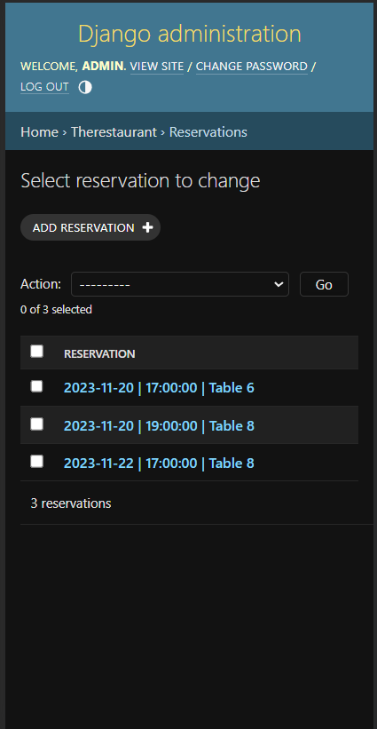
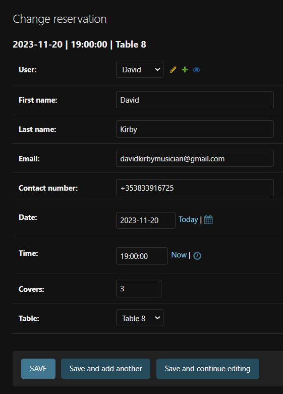
* Within the admin panel, the admin will be able to manage their bookings. All bookings will be returned within the "Reservations" panel. When a booking is made, there is logic that will select a table based on avilability and assign it with the booking. 
* The reservations will be returned with the date, time, and table as their name. 
* Changes can be made to the reservation here by the admin if required. 
  * As a secondary note, the Menu Items can also be modified within their respective admin 
  section also. 
<hr>

#### Defensive Design
* As mentioned above, users will not be able to access certain pages of the website without being authenticated. With both a mix of the dynamic navbar and Django's templating language, the option will not be given to the user - but if the URL is entered manually the user will be prompted to sign in or register regardless. 
<hr>

#### Table Automation 

```python 
def get_available_table(selected_date, selected_time, covers):
    available_tables = Table.objects.filter(table_covers__gte=covers)
    
    for table in available_tables:
        if not Reservation.objects.filter(table=table, date=selected_date, time=selected_time).exists():
            return table

    return None  # No available table found

``` 

* Within the view, a function was created that will return all values from "Table" which have been pre-created using a [management command](#management-command). The function will then take the date and time and check whether a record with the provided parameters exists. If it does not exist it will assign a table, if it is unable to find a table it will return nothing. 
<hr>

#### Management Command 
```python
class Command(BaseCommand):
    help = 'Creates tables with table number and covers.'

    def handle(self, *args, **kwargs):
        tables = [
            Table(table_number=1, table_covers=1),
            Table(table_number=2, table_covers=1),
            Table(table_number=3, table_covers=1),
            Table(table_number=4, table_covers=1),
            Table(table_number=5, table_covers=1),
            Table(table_number=6, table_covers=2),
            Table(table_number=7, table_covers=2),
            Table(table_number=8, table_covers=4),
            Table(table_number=9, table_covers=4),
            Table(table_number=10, table_covers=4)
        ]

        for table in tables:
            table.save()

        self.stdout.write(self.style.SUCCESS('Successfully created 10 Table objects.'))
```

* A management command was created that would allow the restaurant to modify their tables number and covers as needed for the table automation. 
<hr>

### Future Implentations
* For this project, as emails were made optional for signup, i deemed the email booking as not having enough value to implement on this epic. However i do want to implement this in the future and make validated emails mandatory on signup.
* I would like to refactor the table automation so that larger tables do not get occupied by small cover numbers EG 1 person at a table that could seat 4. 
* I would like to redesign the navbar for mobile devices so that a sidebar overlay is used instead of a dropdown as some elements overlay over the dropdown nav element. 

## Technologies Used

### Languages & Packages Used 
Languages HTML, CSS, Python.  

* packages/Frameworks/Libraries:
  * Django Framework - A Full Stack Python web framework.
  * Bootstrap - A framework designed for responsive + rapid web design.
  * Jquery - A javascript library used for DOM manipulation. **
  * Font awesome - A CDN For iconography.
  * AllAuth - Used for User authentication and registration.
  * White Noise - used for deployment to heroku and serving static files. 
  * Gunicorn - A python WSGI HTTP server that aids in deployment.
  * psycopg2-binary - A postgreSQL adapter for python. 
  * django-money - See below.
  * python-decouple - See below.
  * dj-database-url - For parsing the hosted SQL server URL. 
<br>

** _As of Bootstrap v5, jquery is no longer required._

### Package notes


* [python-decouple](https://pypi.org/project/python-decouple/) was used during the developement of this project to experiment with the seperation of configuration settings and code. It also made it easier to carry out version control by having confidence that my environment variables were not exposed. 
```python
    else:
        DATABASES = {
            'default': dj_database_url.parse(config('DATABASE_URL'))
        }
```

* [django-money](https://pypi.org/project/django-money/) is a cool package that allows distinct configuration for django model fields that will contain currencies. When the currency is defined, the corresponding symbol will render.  
  * This package also allows for records in the same column to return with multiple currency symbols which can be chosen from by simply importing the package.  

```python
price = MoneyField(max_digits=14, decimal_places=2, default_currency='EUR')
```
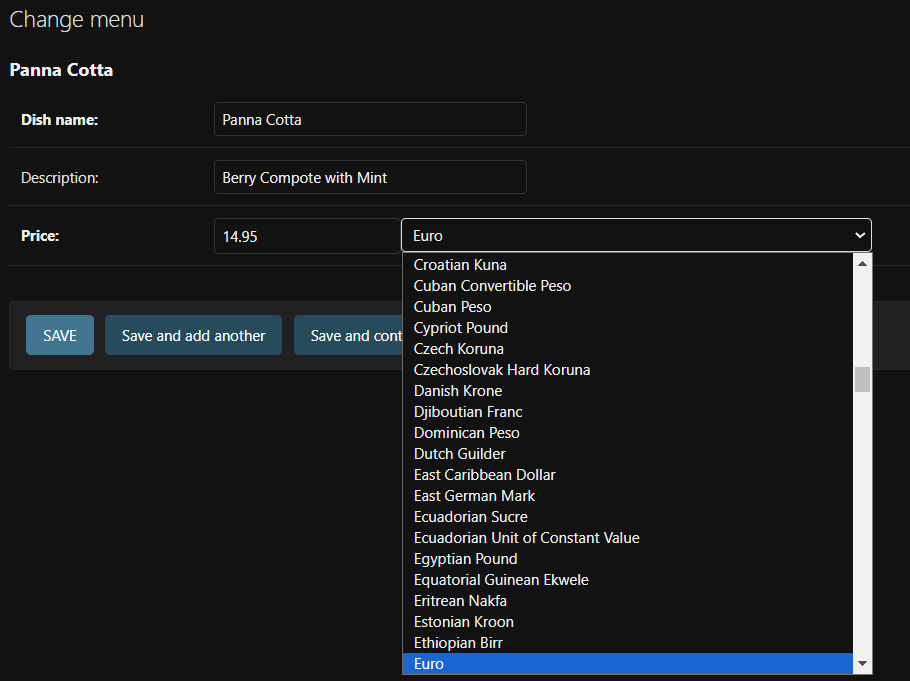


## Database tools
* The development environment used the inbuilt SQLite3 database. 
* PostgreSQL and an externally hosted SQL Server by 
[ElephantSQL.](https://www.elephantsql.com/docs/index.html)
### Programs Used
* Github was used as a repository to store website files and code. <br>
* Gitpod used as the coding environment with git for version control. <br>
* Balsamic For wireframes. 
* Google Dev tools for developement and testing responsiveness. 
* [Figma](https://www.figma.com/files/recents-and-sharing?fuid=1308151216497747353) 
  for creating the Database Schema. 


## Deployment & Local Development

### Deployment
#### ElephantSQL provided the hosting and backend for our SQL database.<br>
The database can be created by the following: <br>
  1. Create a new instance in your ElephantSQL dashboard, this can be found in the top right.
  2. Give your instance a name and choose the region closest to you.
  3. Click create instance in the bottom right.
  4. Copy the URl from your dashboard for the new database. 

#### Heroku Provided the web hosting for our application.
The Heroku App can be created by the following: <br>
  1. From your Heroku Dashboard, click "new" in the top right and create a new app.
  2. Give your App a unique name and click create app. 
  3. Once created, open the app settings and select config var - create a new variable called `DATABASE_URL` and give it the value of the ElephantSQL URL you copied in step 4 previously.
  
#### Preparing your Workspace for Deployment
  1. install dj_database_url and psycopg2 .
  ```python
  pip3 install dj_database_url psycopg2 gunicorn whitenoise
  ```
  2. update your requirements.txt file to reflect your new installs.
  ```python
  pip3 freeze > requirements.txt 
  ```
  3. In my case, i had to add the following line to my requirements.txt due to the version of python/packages installed to allow heroku to deploy: 
  ```python
  backports.zoneinfo==0.2.1;python_version<"3.9"
  ```
  4. Open your .env file and insert your `DATABASE_URL` variable and its URL value(From step 4 in ElephantSQL steps).
  5. In settings.py Under your OS import - write `import dj_database_url`.
  6. Find your DATABASES variable in settings.py and comment it out, replacing it with the below: 
  ```python 
  DATABASES = {
    'default': dj_database_url.parse(os.environ.get('DATABASE_URL'))
  }
  ```
  7. Run your server from the terminal to verify your database connection with `python3 manage.py runserver`

  8. Create your superuser with the terminal command : `python3 manage.py createsuperuser`
  9. View your new superuser within elephant SQL by querying the auth_user table. 
  10. modify your database pointers in settings.py to the below:
  ```python
  if DEBUG:
      DATABASES = {
      'default': {
      'ENGINE': 'django.db.backends.sqlite3',
      'NAME': os.path.join(BASE_DIR, 'db.sqlite3'),
          }
        }
  else:
      DATABASES = {
          'default': dj_database_url.parse(os.environ.get('DATABASE_URL'))
      }
  ```
  11. If your `DEBUG` variable in settings.py is set to `True` you will now use the SQLite database for developement, if false you will be working with the deployed database.
  12. Create a `Procfile` (capital P) in your root directory and add the below line of code to serve your app via gunicorn: 
  ```python
  web: gunicorn YOUR_APP_NAME.wsgi:application
  ``` 
  13. Add the below code into your middleware config in settings.py to configure `whitenoise` and allow it to serve your static files to heroku: 
  ```python
  MIDDLEWARE = [
    # ...
    "django.middleware.security.SecurityMiddleware",
    "whitenoise.middleware.WhiteNoiseMiddleware",
    # ...
  ]
  
  STATICFILES_STORAGE = "whitenoise.storage.CompressedManifestStaticFilesStorage"
  ```

  14. add the below code to your allowed hosts and modify the heroku URL to your deployed URL: 
  ```python
  if DEBUG:
    ALLOWED_HOSTS = ['8000-daviduwl-project4-jwzitk3c01w.ws-eu106.gitpod.io']
  else: 
    ALLOWED_HOSTS = ['therestaurant-ec18b29952b2.herokuapp.com']
  ``` 
  15.  Enable Automatic deployments on Heroku within the deploy section of your app. Connect via your GitHub credentials and search for your current working repo and connect, you will now be able to select automatic deployments below. 
  16. Save your current changes and add a commit message and push to GitHub.

## Forking/Cloning 
To create a fork for this repository: 
* Navigate to the url - https://github.com/DavidUWL/Project-4
  * In the top right corner, click on the Fork dropdown. 
  * Create a new fork
  * Name the repository and/or give it a description - Click create fork. 
* You have now created a fork of this repository! 
To create a clone of this repository:
* Navigate to the url - https://github.com/DavidUWL/Project-4
  * Click on the "code" button and select which format you would like to clone with and copy that link.
  * In your Terminal window of whichever IDE you use, navigate to the whichever directory you want to clone the project to. 
  * type into the terminal "git clone", you have now cloned the project! 


## Testing
Testing for this project was ongoing throughout, Using predemoninantly manual testing in conjunction with Google Dev Tools emulating multiple viewports. Once the database had taken shape and logic was in place, unit testing was then implemented in parallel while developing continued.   

## Validation Testing 
The W3C validator was used to validate all HTML pages on this site and also used to validate the CSS. 

### HTML 

| Page | Result |
| :--- | :--- |
| Home Page | pass |     
| View Booking |      |     
| Amend Booking |      |    
| Cancel Booking |      | 
| Menu |      |       
| Reserve Success |      |

### CSS 
style.CSS file in static directory has passed W3C with no errors. 

```python 
    def prompt_new_game():
        start_new_game = str(input("Would you like to play again? \n Y/N:").upper())

        if start_new_game == "Y":
            clear()
            new_game()
        elif start_new_game == "N":
            sys.exit()
        else:
            prompt_new_game()
```
The above is a very low level recursive function, where if the player has not entered either expected input, it will call itself again. I found this an interesting way to implement validation, but if its use case involved multiple interactions i would deem it too dangerous due to its infinite loop nature. 

### Solved Bugs
* During the project a few bugs were encountered, namely: <br>
  * When print f string literals, it was forgotten that i would need to add 1 to the printing of the computer generated artillery coordinates, as they were generated with zero indexing in mind.
  * A large bug was identified where the board would not update to where player 2 would hit player 1's boats. This was due to a plot_coordinate() function call in the update_UI() function. This was placed so that the users input felt a bit snappier, however would overwrite any UI updates that would be pushed for hits. Once removed this bug was resolved. 
  * A bug where validation was not being applied to the player2 name, this was due to player2 not being passed as an argument to the function. 

### Known Bugs
* At the time of submission, i am not aware of any bugs present.  

### Testing User Stories 

#### First time Vistor
* To quickly be able to play the game without knowing the rules.
  * Players can quickly enter the game, as there are no rules to read, all inputs are prompted when needed with their application. 
* For quick gameplay to be carried out, resulting in a fast-paced rewarding feeling when played. 
  * Upon opening the game, all that is required are names and coordinates, the speed at which is is carried out solely depends on the player. 
#### Returning Visitor
 * To be able to play a different game-set everytime - with the computer choosing different locations/artillery calls every game. 
   * As player boats are chosen by the player and computer boats are placed randomly, the boardset will always be different. The computer will also pick random artillery coordinates for every game. 

## Full testing
Extensive manual testing was carried out to validate that all unexpected data types would be caught and reprompt the user for the correct data type, for example:
* Integers as floating points.
* inputs that were left empty as opposed to containing coordinates or names.
* coordinates that were fired the same place twice, which cannot occur in the original game. 
* Trying to stack boats on top of each other. 

### Lintner
All code passes through the Code Institute lintner with no errors, except for line length which is not deemed as excessive. 


## credits
### Content
All content for this game was created and written by me - David Kirby.

## Media
[ASCII.co.uk](https://ascii.co.uk/art/battleship) ASCII for the ASCII banner.

 
## Acknowledgments
[Derek Mcauley](https://github.com/derekmcauley7) For his guidance as my Code Institute mentor. <br>
[Kera cudmore](https://github.com/kera-cudmore/readme-examples/blob/main/milestone1-readme.md) For her fantastic Readme Template.